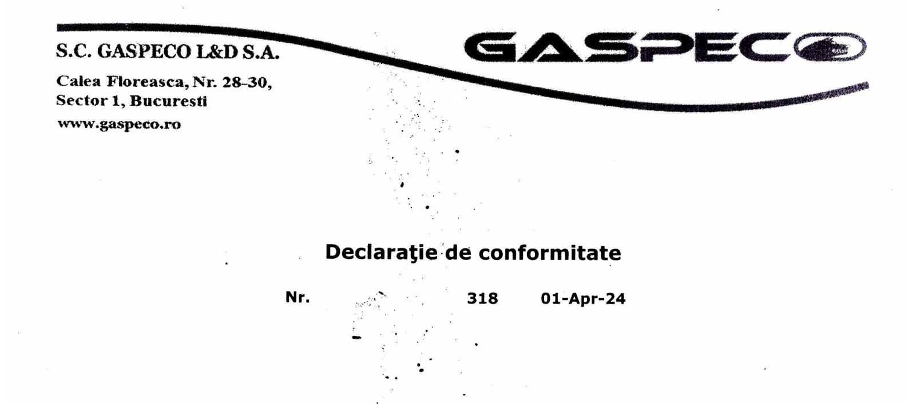

Noi, S.C.GASPECO L&D S.A., cu sediul în Bucuresti Sectorul 1 Calea Floreasca Nr 28-30, cu număr de ordine în Registrul Comerțului J40/8731/11.07.2013 și cod unic de înregistrare fiscală RO8037897, Punct de lucru -Statia de imbuteliere GPL Negoiesti, Prahova, asigurăm, garantăm și declarăm pe proprie răspundere, că :

produsul: Carburant pentru automobile GPL, AUTOGAS tip iarna din

lotul-rezervor nr. : 318ATG-V10 având raport de inspectie nr. 399 în conformitate cu

specificația tehnică:

ST 9 / ediția 5/01.06.2022

, la care se refera această declarație, nu pune în pericol viața, sănătatea, securitatea muncii, nu produce un impact negativ asupra mediului în condițiile respectării prevederilor din Fișa cu Date de Secutitate, rev.9/25.10.2022. Produsul este certificat de Registrul Auto Român, după SR EN 589+A1/2022, conform Certificatului de conformitate cu nr.3055/09.12.2022.

Termenul de valabilitate al produsului este de 6 luni, în condițiile depozitării și manipulării conform prevederilor din Fişa cu Date de Secutitate

Densitatea produsului la 15 º C

0.5321 kg/ dm3

NR. AUTO:

Stația de îmbuteliere GPL Gaspeco L&D SA - Negoiești 01-Apr-24

Director statie,
2 Mg. Cristian DOCHIAN

- \*
  GASPECO L&D S.A.

ROMANIA

Prezenta declaratie este intocmita conform conf:SR EN ISO/CEI 17050-1

**COMPANY WITH MANAGEMENT SYSTEM** CERTIFIED BY DNV-GL  $\approx$  ISO 9001  $\approx$  $=$  ISO 14001 =  $=$  OH5AS 18001 =

GASPECO L&D S.A. Nr.inregistrare J40/8731/2013 Cod Fiscal: RO 8037897