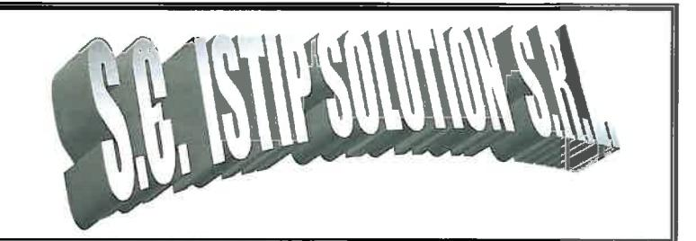

## Anexa 3 Certificat de verificare metrologica debitmetru

Laboratorul de metrologie al ................................... . . . . . . . . . . . . . . . . . . .

## ZCFE6LRSMOC520994 0124507

**6694** 

Buletin de verificare metrologică"¹)

nr 0124507 data emiterii 15.03 2024 ora 15-
CTRANSPECO LED

Buletin de verificare metrologică1 Mijloace de măsurare aparținând SC TRANS PECO (10 S A DUCUREST), ca ... (512 prezentate la verificare metrologică au obținut următoarele rezultate: we specificare de strukturinătoarel

| Nr. buc.                                     | Mijloc de masurare-denumire, tip, producător, caracteristici, seria/an de fabricație²⁾                                                                                 | Codul din LT | Normativ (NML, NTM etc) | Etaloane utilizate - Denumire, serie, nr. C.E. | Rezultatul verificării ³⁾ | Valabilitatea verificării | Cost          |
|-------------------------------------------------|------------------------------------------------------------------------------------------------------------------------------------------------------------------------|-----------------|----------------------------|---------------------------------------------------|------------------------------|------------------------------|---------------|
| 1.                                              | SIST DE MASURARE A CANT DE LICHIDE ALTELE DECAT APA FABR: LIQUID CONTROLS Seria: 23052118 TIP: MA 7-10 AM: RO 071 Qmin- 76 l/min Qmax - 380 l/min | 1.0655          | NML 007-05                 | Mateu GPL Seria 659 CE: PEM 3700182101      | ADMIS                        | 3 ANI                        | Conf. Laut |
| Locul efectuării verificării metrologice: ARAD  |                                                                                                                                                                        |                 |                            |                                                   |                              |                              |               |
| Data și ora finalizării măsurărilor: 15.03.2024 |                                                                                                                                                                        |                 |                            |                                                   | 15⁰⁰                         |                              |               |
|                                                 |                                                                                                                                                                        |                 |                            |                                                   |                              |                              | Total         |

 Verificator metrolog:  
 Nume, prenume: Ielecutean A.  
 Prezentul document a fost predat beneficiarului
Nume, prenume 1980 c. t Pous M. Nume, prenume, B.I./C.I., nr. împutemicire...................................

 $Miloc$  de măsurare des ...

Prezentul document a fost predat beneficiarului.
Nume, prenume, B.I./C.I., nr. împuternicire..........
Data o

, ora
1) Prezentul buletin nu se referă la caracteristici sau funcții pentru care nemarcate.
2) În cazul în

u conţin cerinţe metrologice sau tehnice
În cazul evaluării conformitätü
Jacelor de masurare pentru care, conform reglementărilor în vigoare, este prevăzută anu

leteaza numarul documentului care aprobă tipul.
3) Dacă rezultatul este "RESPINS" se prezintă quagint

1) Prezentul buletin nu se referă la caracteristici sau funcții pentru care normativele nu conțin cerințe metrologice sau tehnice; 2) în cazul mijloacelor de măsurare pentru care, conform reglementărilor în vigoare, este

**SC ISTIP SOLUTION SRL CUI RO25746694** T02/723/2009 Arad Tel / fax: 0357.816.076 Mobil: 0748.103.920 e-mail: istip.solution@gmail.com

Anexa 1 la BVM nr. 0124507 / 15.03.2024

## Fişa de identificare a sistemului

Sistem de măsurare a cantităților de lichide, altele decât apa:

**Tip: MA 7-10** Serie: 23052118 Clasă exactitate: 1 AM / certificat de examinare: AM RO 071 Loc utilizare: montat pe cisterna cu nr. ZCFE62RS10C520994 **Producator: LIQUID CONTROLS EUROPE** Deținător: S.C. TRANSPECO L&D S.A. Bucuresti, Calea Dorobantilor, Nr. 2

Laboratorul: S.C. ISTIP SOLUTION S.R.L.

 $Q_{min} = 76$  I/min;  $Q_{\text{max}} = 380$  l/min;  $t_{\rm min}$  = -20 °C;  $t_{\text{max}}$  = +55 °C;  $MMO = 1001$ 

| <b>Componente principale</b> | <b>Tip/Producator</b> | <b>Serie</b> | <b>Caracteristici</b> |
|------------------------------|-----------------------|--------------|-----------------------|
| Traductor/Contor de debit    | MA 7-10               | 23052118     | MMQ = 100 l           |
| Calculator de debit          | TECALIMIT             | 1921758      | EN 148                |
| Traductor de temperatură     | PT 100                | 1104VSY      | $-20$ °C +55 °C       |
| Imprimanta                   |                       | J9LF189341   |                       |

Sigilarea s-a efectuat în toate punctele identificate conform schemei de sigilare din documentația de sistem, cu sigiliu cu plumb RO24ny2.

**FACTOR CORECTIE** 001,84200

Verificator metrolog,
Jelecuteanu Alexand 46694
\*
2
J2/723/200.
ISTIP
COLUTION
S.R.L.
Vladimirescu.