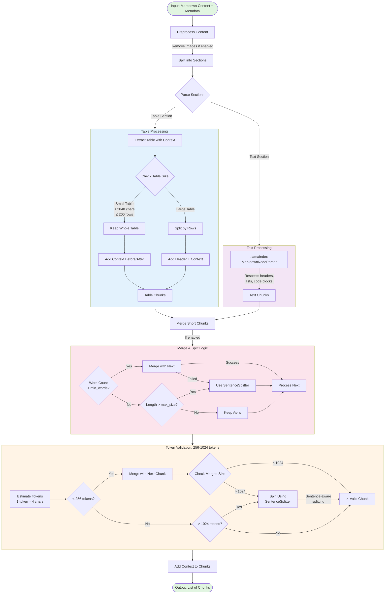
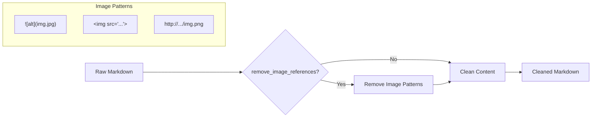
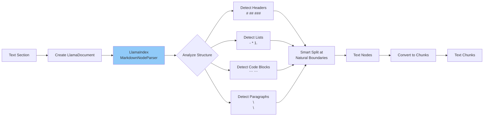
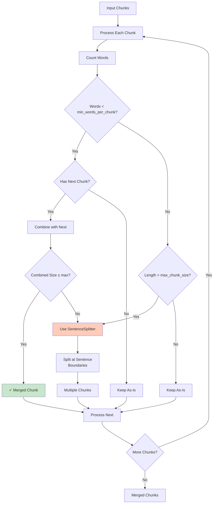
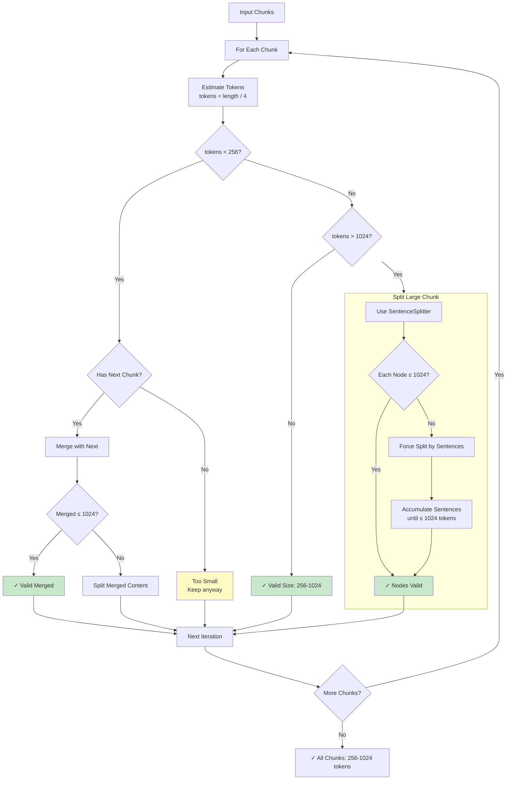
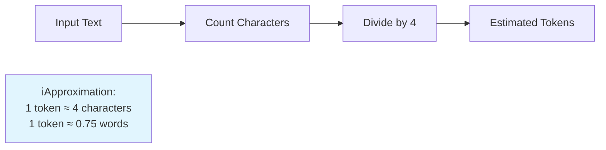
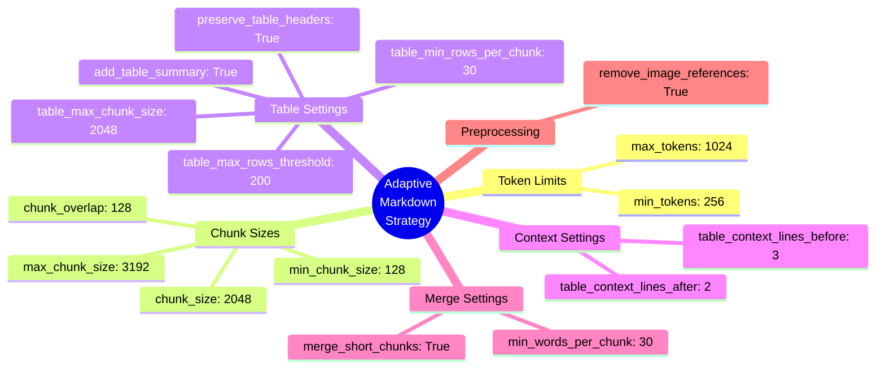

# Adaptive Markdown Chunking Algorithm



## Detailed Component Descriptions

### 1. Preprocessing



**Patterns Removed:**
- `` - Markdown images
- `` - HTML images
- `http://.../image.png` - Direct image URLs

### 2. Section Splitting

```mermaid
flowchart TD
    Start[Markdown Content] --> ParseLine{Parse Line by Line}

    ParseLine --> CheckTable{Is Table Line?<br/>Contains | and count ≥ 3}

    CheckTable --> |Yes| ExtractTable[Extract Complete Table]
    CheckTable --> |No| ExtractText[Extract Text Section]

    ExtractTable --> GetContextBefore[Get Context Before<br/>3 lines]
    GetContextBefore --> CollectRows[Collect All Table Rows]
    CollectRows --> DetectHeader{Detect Header?<br/>Next line is separator}
    DetectHeader --> GetContextAfter[Get Context After<br/>2 lines]
    GetContextAfter --> TableSection[Table Section]

    ExtractText --> TextSection[Text Section]

    TableSection --> Continue{More Lines?}
    TextSection --> Continue
    Continue --> |Yes| ParseLine
    Continue --> |No| Sections[List of Sections]

    style TableSection fill:#e3f2fd
    style TextSection fill:#f3e5f5
```

### 3. Table Chunking Strategy

```mermaid
flowchart TD
    TableSection[Table Section Input] --> ExtractHeaderData[Extract Header & Data]

    ExtractHeaderData --> CheckHeader{Has Separator Line?}
    CheckHeader --> |Yes| SeparateHeader[Header = First 2 lines<br/>Data = Rest]
    CheckHeader --> |No| NoHeader[No Header<br/>All = Data]

    SeparateHeader --> EvaluateSize{Evaluate Size}
    NoHeader --> EvaluateSize

    EvaluateSize --> CheckConditions{Size ≤ 2048 chars<br/>AND<br/>Rows ≤ 200?}

    CheckConditions --> |Yes| BuildWhole[Build Single Chunk]
    CheckConditions --> |No| CalculateRows[Calculate Rows per Chunk]

    subgraph BuildWhole [Keep Whole Table]
        AddSummary1[Add Table Summary<br/>e.g., Table: 50 rows, columns: A, B, C]
        AddSummary1 --> AddCtxBefore1[Add Context Before]
        AddCtxBefore1 --> AddTable1[Add Complete Table]
        AddTable1 --> AddCtxAfter1[Add Context After]
    end

    subgraph CalculateRows [Split Large Table]
        CalcAvgRow[Calculate Average Row Size]
        CalcAvgRow --> CalcPerChunk[Rows per Chunk =<br/>max(calculated, min_rows)]
        CalcPerChunk --> SplitLoop[Split Data by Rows]

        SplitLoop --> FirstChunk{First Chunk?}
        FirstChunk --> |Yes| AddSummary2[Add Summary + Context]
        FirstChunk --> |No| NoSummary[No Summary]

        AddSummary2 --> AddHeader[Add Header if preserve_header]
        NoSummary --> AddHeader
        AddHeader --> AddRows[Add Row Chunk]

        AddRows --> LastChunk{Last Chunk?}
        LastChunk --> |Yes| AddCtxAfter2[Add Context After]
        LastChunk --> |No| NextChunk[Next Chunk]

        AddCtxAfter2 --> NextChunk
        NextChunk --> MoreRows{More Rows?}
        MoreRows --> |Yes| SplitLoop
    end

    BuildWhole --> OutputChunks[Table Chunks]
    CalculateRows --> OutputChunks

    style BuildWhole fill:#c8e6c9
    style CalculateRows fill:#ffccbc
```

### 4. Text Chunking with LlamaIndex



### 5. Merge & Split Logic



### 6. Token Validation (256-1024 tokens)



## Token Estimation



## Configuration Parameters


