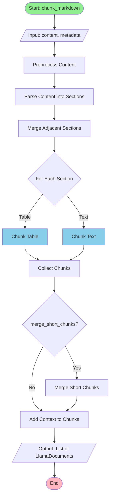
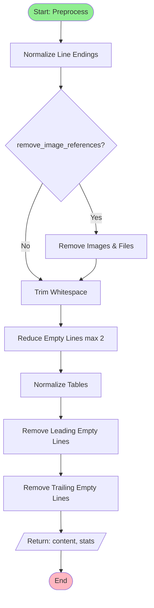
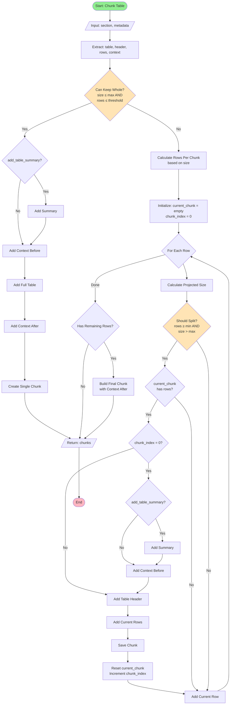
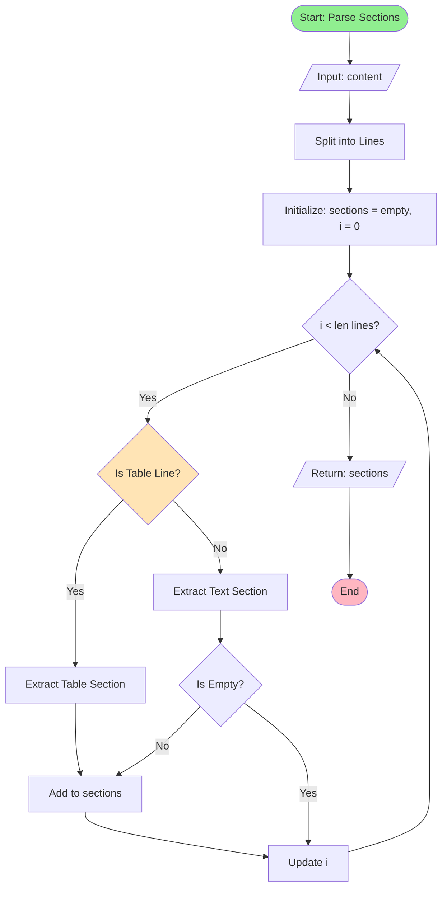
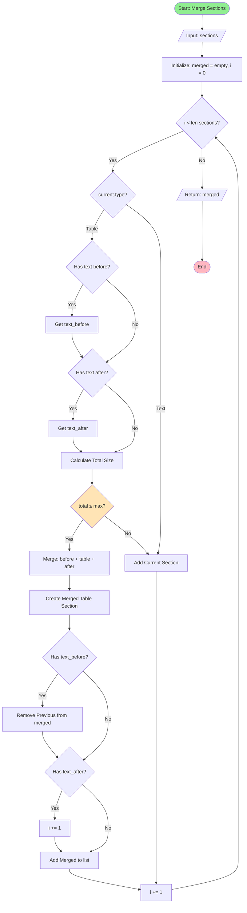
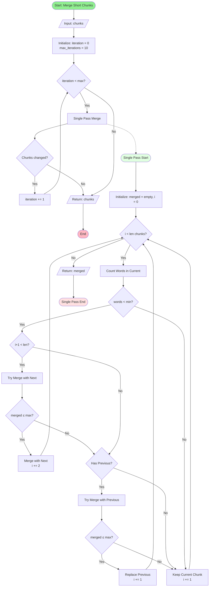
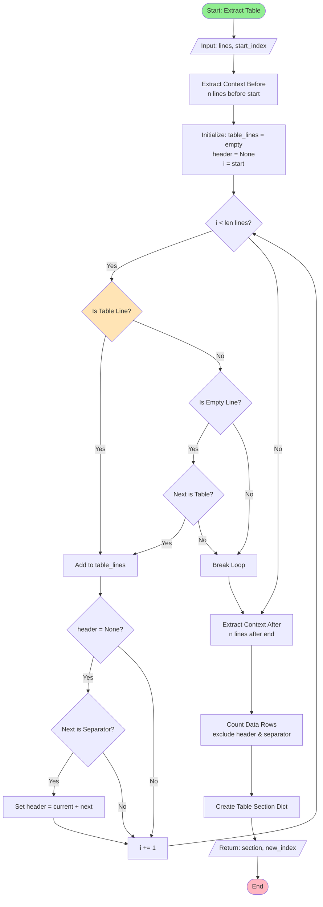

# Adaptive Markdown Chunking Strategy Algorithm

## Overview

The `AdaptiveMarkdownStrategy` implements an intelligent chunking algorithm for Markdown documents that handles both text and table content with adaptive strategies to preserve semantic meaning and context.

## Main Algorithm Flow (Mermaid)



## Preprocessing Flow



## Table Chunking Flow



## Section Parsing Flow



## Section Merging Flow



## Short Chunk Merging Flow



## Table Detection & Extraction Flow



## Key Features

- Smart table detection and preservation
- Context-aware chunking for tables
- Adaptive text chunking using LlamaIndex
- Table header preservation across chunks
- Short chunk merging
- Image and file reference removal
- Table normalization and deduplication

## Algorithm Flow

### 1. Main Chunking Process (`chunk_markdown`)

```
Input: Markdown content string, metadata
Output: List of LlamaDocument chunks

1. Preprocess content
   ├── Normalize line endings
   ├── Remove image/file references (optional)
   ├── Remove excessive empty lines
   └── Normalize table formatting

2. Parse content into sections
   ├── Identify table sections
   └── Identify text sections

3. Merge adjacent sections
   └── Combine small text sections with nearby tables if size permits

4. Chunk each section
   ├── Tables → _chunk_table()
   └── Text → _chunk_text()

5. Merge short chunks (optional)
   └── Combine chunks below minimum word threshold

6. Add context to chunks
   └── Enhance chunks with contextual information

Return: Processed chunks
```

### 2. Content Preprocessing (`_preprocess_content`)

**Purpose**: Clean and normalize content before chunking

**Steps**:
1. **Line ending normalization**: Convert all line endings to `\n`
2. **Image/file removal**: Remove references to images and files using regex patterns
   - Image formats: jpg, jpeg, png, gif, svg, bmp, webp, ico, tiff
   - File formats: pdf, docx, xlsx, pptx, zip, rar, 7z, tar, gz
3. **Whitespace trimming**: Remove trailing whitespace from lines
4. **Empty line reduction**: Limit consecutive empty lines to maximum 2
5. **Table normalization**: Fix table formatting issues
6. **Leading/trailing cleanup**: Remove empty lines at start/end

**Statistics tracked**:
- Removed empty lines count
- Normalized tables count
- Removed duplicate rows count
- Trimmed whitespace count
- Fixed table formatting count
- Removed image references count
- Removed file links count

### 3. Table Detection and Extraction

#### Table Line Detection (`_is_table_line`)
```
A line is considered a table line if:
- Contains '|' character
- Has at least 3 '|' characters
```

#### Table Separator Detection (`_is_table_separator`)
```
Pattern: |?[\s-:|]+|[\s-:|]*
Example: |---|---|---|
```

#### Table Extraction (`_extract_table_section`)
```
1. Extract context before table (configurable lines)
2. Extract all consecutive table lines
3. Identify table header (first row + separator)
4. Extract context after table (configurable lines)
5. Count data rows (excluding header and separator)

Return: Section dictionary with:
- type: 'table'
- content: full table text
- table_only: table without context
- header: [header_row, separator_row]
- row_count: number of data rows
- context_before: text before table
- context_after: text after table
```

### 4. Table Normalization

#### Row Normalization (`_normalize_table_row`)
```
For each cell in row:
1. Trim whitespace
2. Collapse multiple spaces to single space
3. Add padding spaces: ' cell_content '
4. Join with '|' delimiter
```

#### Separator Normalization (`_normalize_table_separator`)
```
For each separator cell:
1. Detect alignment:
   - ':---:' → Center aligned
   - '---:'  → Right aligned
   - ':---'  → Left aligned
   - '---'   → Default/left aligned
2. Standardize format
```

#### Duplicate Row Removal
```
1. Normalize each row (remove all whitespace)
2. Track seen rows in set
3. Keep only first occurrence of each unique row
4. Count and report duplicates removed
```

### 5. Section Merging (`_merge_adjacent_sections`)

**Goal**: Merge small text sections with adjacent tables when beneficial

**Algorithm**:
```
For each table section:
1. Check if previous section is text
2. Check if next section is text
3. Calculate total size:
   total = table_size + before_size + after_size + 10

4. If total <= table_max_chunk_size:
   ├── Create merged section
   ├── Include context_before from previous text
   ├── Include table content
   ├── Include context_after from next text
   └── Mark as 'table' type with merged context flag

5. Otherwise:
   └── Keep sections separate
```

**Benefits**:
- Preserves semantic relationship between tables and surrounding text
- Reduces total chunk count
- Maintains context for better retrieval

### 6. Table Chunking (`_chunk_table`)

**Decision Tree**:

```
Can keep whole table?
├── YES (size <= max AND rows <= threshold)
│   ├── Add table summary (optional)
│   ├── Add context before
│   ├── Add full table
│   ├── Add context after
│   └── Create single chunk
│
└── NO (size > max OR rows > threshold)
    ├── Calculate rows per chunk:
    │   ├── header_size = sum(header line lengths)
    │   ├── avg_row_size = average data row length
    │   ├── available_size = max_chunk_size - header_size - 100
    │   └── rows_per_chunk = max(available_size / avg_row_size, min_rows)
    │
    └── Iteratively chunk rows:
        For each row:
        ├── Calculate projected_size = current_size + row_size + header_size
        ├── Should split if:
        │   ├── (rows >= min_rows AND size > max) OR
        │   └── (rows >= estimated_rows)
        │
        ├── On split:
        │   ├── Add summary to first chunk (optional)
        │   ├── Add context_before to first chunk
        │   ├── Add header to all chunks (if preserve_headers)
        │   ├── Add accumulated rows
        │   └── Create chunk
        │
        └── Add context_after to last chunk
```

**Parameters**:
- `table_max_chunk_size`: Maximum size for table chunks (default: 2048)
- `table_min_rows_per_chunk`: Minimum rows per chunk (default: 30)
- `table_max_rows_threshold`: Max rows for keeping whole (default: 200)
- `preserve_table_headers`: Include headers in all chunks (default: True)
- `add_table_summary`: Add summary to chunks (default: True)

### 7. Text Chunking (`_chunk_text`)

**Strategy**: Delegate to LlamaIndex parsers

```
1. Create temporary LlamaDocument with text
2. Use MarkdownNodeParser to parse document
   - Respects markdown structure
   - Preserves headings, lists, code blocks
3. Convert nodes back to LlamaDocument chunks
4. Preserve metadata across chunks
```

### 8. Short Chunk Merging (`_merge_short_text_chunks`)

**Purpose**: Eliminate chunks below minimum word threshold

**Multi-pass Algorithm**:
```
Repeat up to 10 iterations:
1. For each chunk in sequence:
   ├── Count words in chunk
   │
   ├── If words < min_words_per_chunk:
   │   ├── Try merge with next chunk:
   │   │   └── If merged_size <= max_chunk_size:
   │   │       ├── Merge with '\n\n' separator
   │   │       └── Skip next chunk
   │   │
   │   └── Otherwise, try merge with previous:
   │       └── If merged_size <= max_chunk_size:
   │           └── Replace previous chunk with merged
   │
   └── Otherwise, keep chunk as-is

2. If no merges occurred, stop
3. Otherwise, repeat with new chunk list

Limit: Maximum 10 iterations to prevent infinite loops
```

**Word Count**: Simple split on whitespace

### 9. Table Summary Generation (`_generate_table_summary`)

**Format**: `[Table Summary: {rows} rows with columns: {col_names}]`

**Algorithm**:
```
1. Extract header row
2. Split by '|' and clean column names
3. Take first 5 column names
4. If more than 5 columns:
   └── Add "... (N columns total)"
5. Format summary with row count and columns
```

**Example**: `[Table Summary: 150 rows with columns: Name, Age, Email, Phone, Address, ... (12 columns total)]`

## Configuration Parameters

| Parameter | Default | Description |
|-----------|---------|-------------|
| `chunk_size` | 2048 | Base chunk size for text |
| `chunk_overlap` | 128 | Overlap between text chunks |
| `min_chunk_size` | 128 | Minimum chunk size |
| `max_chunk_size` | 3192 | Maximum chunk size |
| `table_max_chunk_size` | 2048 | Maximum size for table chunks |
| `table_min_rows_per_chunk` | 30 | Minimum rows per table chunk |
| `table_max_rows_threshold` | 200 | Max rows to keep table whole |
| `preserve_table_headers` | True | Include headers in all table chunks |
| `add_table_summary` | True | Add summary to table chunks |
| `table_context_lines_before` | 3 | Context lines before table |
| `table_context_lines_after` | 2 | Context lines after table |
| `min_words_per_chunk` | 30 | Minimum words to avoid merging |
| `remove_image_references` | True | Remove image/file links |
| `merge_short_chunks` | True | Enable short chunk merging |

## Data Structures

### Section Dictionary (Table)
```python
{
    'type': 'table',
    'content': str,              # Full content including context
    'table_only': str,           # Just the table
    'header': List[str],         # [header_row, separator_row]
    'row_count': int,            # Number of data rows
    'context_before': str,       # Text before table
    'context_after': str,        # Text after table
    'has_merged_context': bool,  # If merged with adjacent text
    'merged_content_size': int   # Size after merging
}
```

### Section Dictionary (Text)
```python
{
    'type': 'text',
    'content': str  # Text content
}
```

## Regex Patterns

### Image Detection
- Markdown: `!\[.*?\]\([^\)]*\.(jpg|jpeg|png|gif|svg|bmp|webp|ico|tiff?)[^\)]*\)`
- HTML: `]*\.(jpg|jpeg|png|gif|svg|bmp|webp|ico|tiff?)[^>]*/?>`
- URL: `(?<!\[)\bhttps?://\S+\.(jpg|jpeg|png|gif|svg|bmp|webp|ico|tiff?)\b`
- Path: `(?:^|\s)[\w./\\-]+\.(jpg|jpeg|png|gif|svg|bmp|webp|ico|tiff?)\b`

### File Link Detection
- Markdown: `\[([^\]]*)\]\([^\)]*\.(pdf|docx?|xlsx?|pptx?|zip|rar|7z|tar|gz)[^\)]*\)`
- URL: `(?<!\[)\bhttps?://\S+\.(pdf|docx?|xlsx?|pptx?|zip|rar|7z|tar|gz)\b`

### Table Separator
- Pattern: `^\s*\|?[\s\-:|]+\|[\s\-:|]*$`

## Performance Considerations

1. **Multi-pass Processing**: Uses up to 10 iterations for chunk merging
2. **Regex Efficiency**: Pre-compiled patterns for image/file removal
3. **Memory**: Processes content line-by-line where possible
4. **Deduplication**: Uses set-based duplicate detection for O(n) complexity

## Edge Cases Handled

1. **Tables without headers**: Generates standard separator
2. **Malformed tables**: Normalizes formatting
3. **Very large tables**: Splits adaptively by size and row count
4. **Single-row chunks**: Merges with adjacent chunks
5. **Empty lines in tables**: Preserves if followed by more table content
6. **Duplicate table rows**: Removes while preserving order
7. **Mixed content**: Merges text and tables when size permits
8. **Short chunks at boundaries**: Multiple merge strategies

## Output Format

Each chunk is a `LlamaDocument` with:
- `text`: The chunk content (str)
- `metadata`: Preserved from input (Dict)

Chunks maintain semantic coherence and include necessary context for retrieval and understanding.
