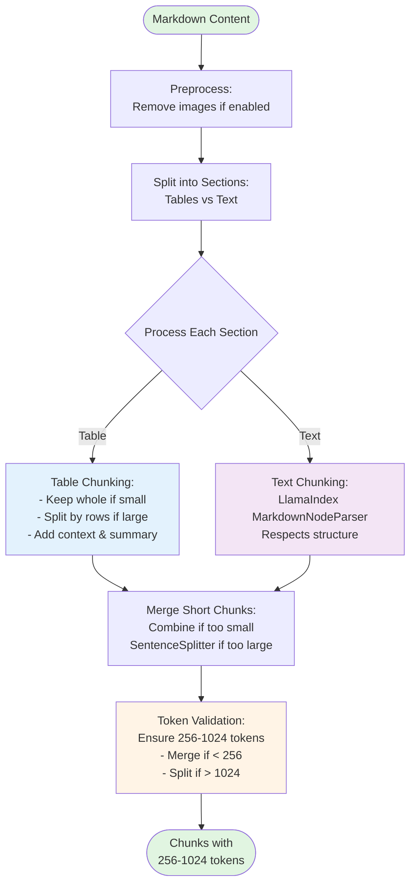

# Adaptive Markdown Chunking Algorithm

## Algorithm Flow

## Key Components

### 1. Preprocessing
- Normalize line endings
- Remove image references (optional)

### 2. Section Splitting
- Detect table lines: `|` with count ≥ 3
- Extract text sections between tables
- Capture context around tables (3 lines before, 2 after)

### 3. Table Chunking
- **Small tables** (≤2048 chars, ≤200 rows): Keep whole
- **Large tables**: Split by rows, preserve headers
- Add table summary and context

### 4. Text Chunking
- Use **LlamaIndex MarkdownNodeParser**
- Respects markdown structure (headers, lists, code blocks)
- Natural boundary detection

### 5. Merge & Split
- Use **LlamaIndex SentenceSplitter**
- Merge short chunks (< min_words)
- Split large chunks (> max_size)

### 6. Token Validation
- Estimate tokens: `length / 4`
- Ensure range: **256-1024 tokens**
- Merge or split as needed

## Output Guarantee

✅ All chunks between **256-1024 tokens**
✅ Tables preserved with headers
✅ Markdown structure respected
✅ Semantic boundaries maintained
