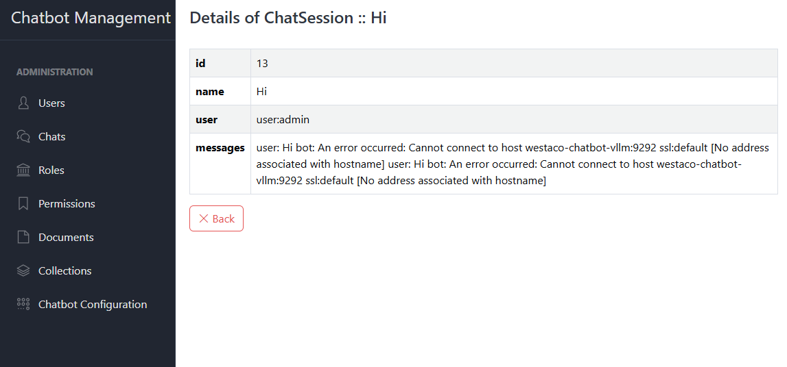

# Chat Sessions

This section describes how to browse, inspect, and remove user chat sessions. Only users with `chat_session.view` or
`chat_session.delete` permissions can perform these actions.

## 1. List Chat Sessions

- Navigate to **Chats** in the main menu.
- The table displays:
    - **id**
    - **uuid**
    - **name**
    - **user**
    - **actions**

## 2. View Session Details

1. Click **Details** on the desired row.
2. The detail page shows:
    - **Session Metadata** (User, Start and End timestamps)
    - **Full Transcript** rendered as a chronological list or timeline
    - Optionally filter by message author (User vs. Chatbot)
3. You can scroll through the exchange or copy/export the transcript as JSON or Markdown.

## 3. Delete Chat Session

1. In the **Chat Sessions** list, click **Delete** next to a session.
2. Confirm the prompt:
   > Are you sure you want to permanently delete this chat session and all its messages?
3. Upon confirmation, the session and its transcript are removed from the database.
4. A flash notification confirms the successful deletion.

