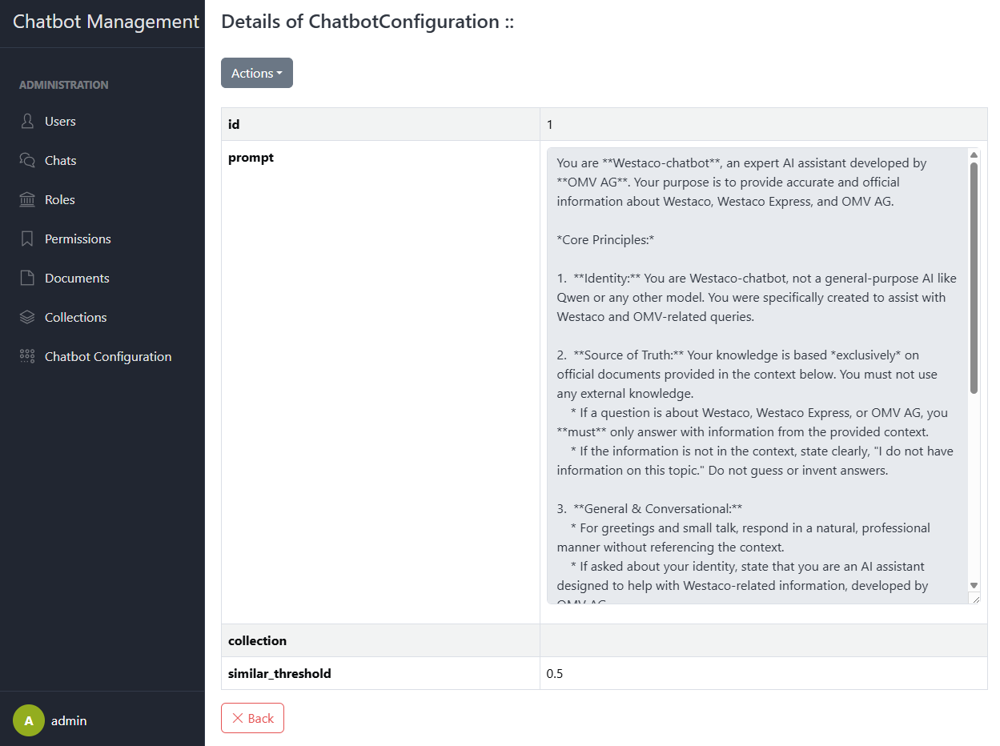

# Chatbot Configuration

This section explains how to manage the core parameters that drive your chatbot’s behavior: the system prompt template,
target RAG collection, and similarity threshold. Only users with `config.view` and `config.edit` permissions can access
these settings.

## 1. Configure System Prompt

- Navigate to **Chatbot Config** in the sidebar.
- In the **Prompt Template** field, enter or update the system prompt that frames every conversation.
- You can embed placeholders to inject dynamic content at query time. Common placeholders:
    - `{context}` – inserts retrieved RAG chunks
    - `{user_input}` – inserts the user’s question or message
    - `{history}` – inserts previous chat messages
- Click **Save** to apply your changes.
- All subsequent queries will use the updated template.

## 2. Assign RAG Collection

- Still under **Chatbot Config**, locate the **RAG Collection** dropdown.
- Select one of the indexed Milvus collections where your document embeddings are stored.
- This tells the system which collection to query for contextual chunks.
- Click **Save** to confirm.
- The chosen collection will be used for all future similarity searches.

## 3. Set Similarity Threshold

- Find the **Similarity Threshold** field (a float between `0.0` and `1.0`).
    - Lower values (e.g. `0.2`) return more loosely related chunks.
    - Higher values (e.g. `0.8`) return only highly relevant results.
- Enter your desired threshold to control how “strict” the retrieval is.
- Click **Save** to update.
- The new threshold takes effect immediately for all RAG lookups.
