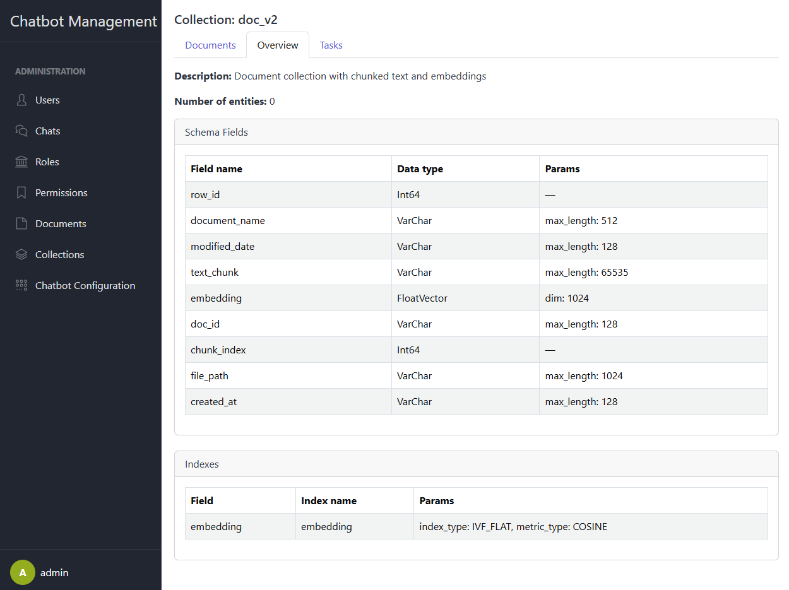
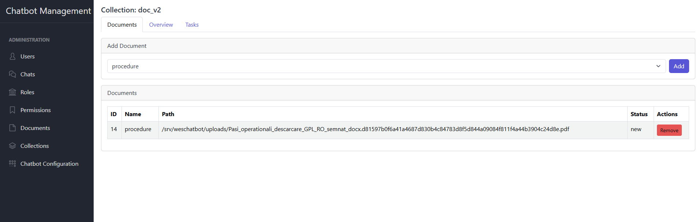
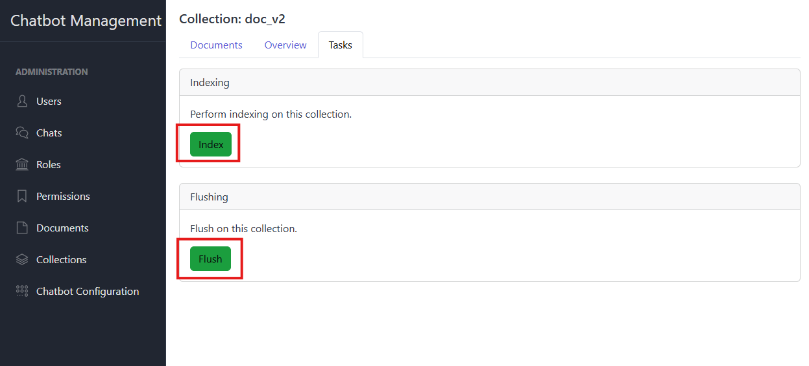

# Collection Management

This section covers how to manage Milvus collections within the Chatbot Management System: listing collections, viewing
details and indexed documents, rebuilding indexes, flushing data, and deleting collections. Only users with the
appropriate `collection.*` permissions can perform these actions.

## 1. List Collections

- Navigate to **Collections** in the sidebar.
- The table displays:
    - **Collection Name**
    - **Vector Count**
    - **Created At**
- Actions per row:
    - **Details**
    - **Delete**

## 2. View Collection Details

### 2.1. Collection's information in Milvus

- Click **Details** on the target collection then click **Overview**.
- The detail view shows:
    - **Name**
    - **Vector Count**
    - **Schema** (field definitions and types)
    - **Documents**: list of all documents or chunks indexed into this collection

### 2.2. Documents

- Click **Documents**.
  - You can add a document to collection or remove a document from collection.

## 3. Tasks

### 3.1. Index Collection

- On the collection detail page, click **Index**.
- The system will rebuild the Milvus index for all vectors in this collection.
- You may see a progress indicator or receive a notification once indexing completes.

### 3.2. Flush Collection

- Click **Flush** to clear any in-memory or pending vector data and persist segments to disk.
- Collection metadata and already indexed vectors remain intact.

## 4. Delete Collection

- In the **Collections** list, click **Delete** next to a collection.
- Confirm the prompt:
  > Are you sure you want to permanently delete this collection and all its vectors?
- Upon confirmation, the collection and all associated vectors are removed from Milvus.
- A success notification confirms the deletion.

---
