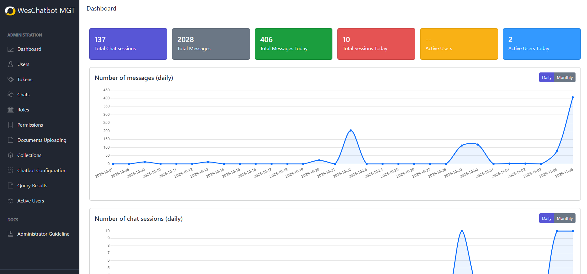

# Dashboard

The Dashboard page shows summary metrics and trend charts to help you quickly understand system activity: chat sessions,
messages, active users, and time-based charts. This guide focuses only on how end users interact with the UI.

---

## Reading the Cards

- Each card displays a single summary metric (e.g., **Total Chat sessions**, **Total Messages**, **Total Messages Today
  **).
- Card colors are only for visual distinction and do not indicate warnings.
- Action: click a card to navigate to the detailed view or page for that metric.

---

## Using the Charts (StatsChart)

- **Display modes**
    - **Daily**: shows data by day (default shows the last 30 days).
    - **Monthly**: shows data by month (default shows the last 12 months).
- **Interaction**
    - Hover a data point to see a tooltip with the exact value for that day/month.
    - Use the control (if available) to toggle between daily and monthly views.
- **Purpose**
    - **Number of messages** chart visualizes message volume over time.
    - **Number of chat sessions** chart visualizes session count over time.

---

## Navigation and Quick Actions

- Click a card to view detailed data for that metric.
- Use chart controls (if present) to change the time range or mode.
- To export reports or view more granular data, open the detailed page from the card (access depends on your user
  permissions).

---

## Time Range and Timezone

- Dates shown in charts follow the system’s configured timezone.
- If “today” appears different from your local date, check the dashboard timezone setting or contact an administrator.

---

## Common Issues and Quick Fixes

- **Card or chart shows no data**
    - Reload the page.
    - If the issue remains, verify your account permissions or contact the admin.
- **Chart loads slowly**
    - Wait a few seconds for data to load; if it remains slow, reload or notify operations.
- **Values look incorrect**
    - Check whether you are viewing daily vs monthly mode and confirm the selected time range.

---

## Usage Tips

- Start by scanning the cards to get a quick status snapshot, then inspect charts for trends.
- Use **Daily** for short-term analysis and **Monthly** for long-term trends.
- When reporting an issue to admin, note the metric, the date/time, and a brief description to help troubleshooting.
