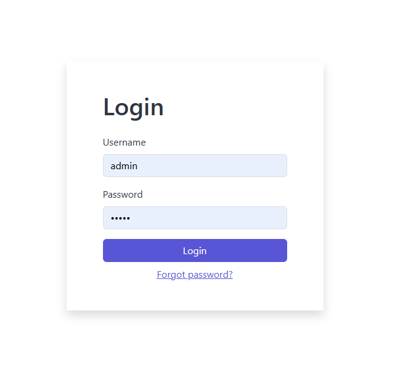
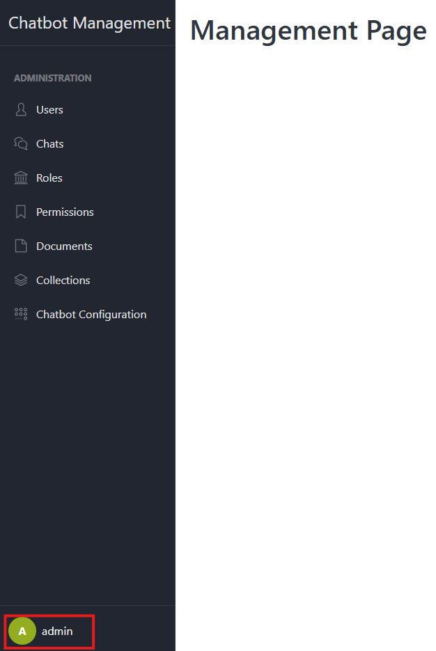
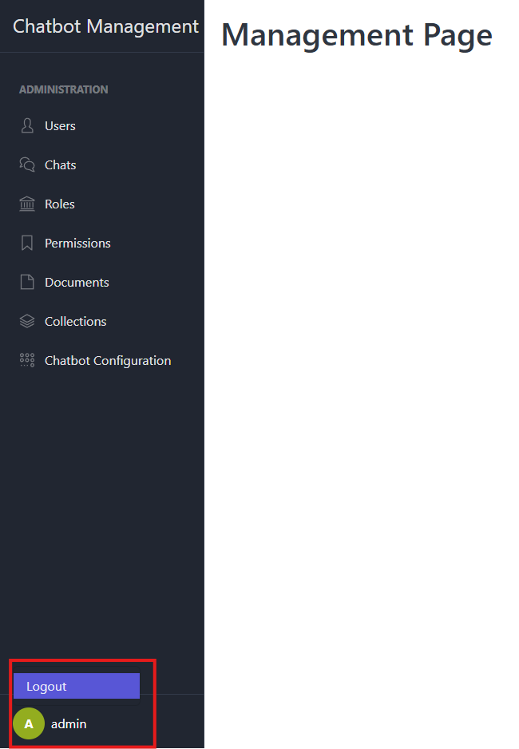

# Login

This section describes how users authenticate into the Chatbot Management System: the form fields, validation logic,
error handling, session creation and expiration settings, and how the user’s identity is displayed once logged in.

## 1. Login Form

### 1.1 Login Form

Access to `<your_domain>/management/` you will see the login form.



### 1.2 Fields

- **Username**  
  A text input validated for proper email format.
- **Password**  
  A password input (`type="password"`) that must be non-empty.
- **Submit Button**  
  Labeled “Log In” or similar; triggers credential submission.

## 2. Session Management

- **Session Creation**
    - On successful login, store `user_id`, `role`, and login timestamp in the session.
    - Mark session as permanent if you want it to respect a global timeout.
- **Display User Name**
    - In the bottom sidebar, show
      ```
      {{ current_user.name }}
      ```  
      
- **Logout**
    - Hover to your user name then clicking **Log Out** clears the session and redirects back to the login page.
      
