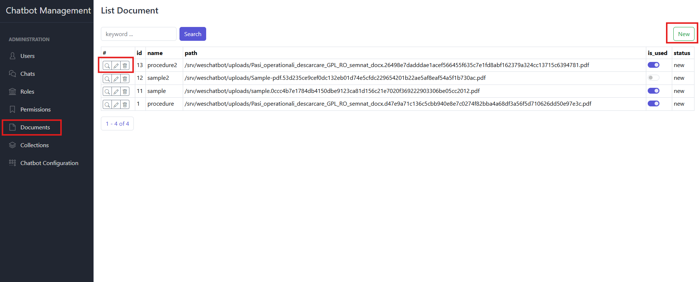
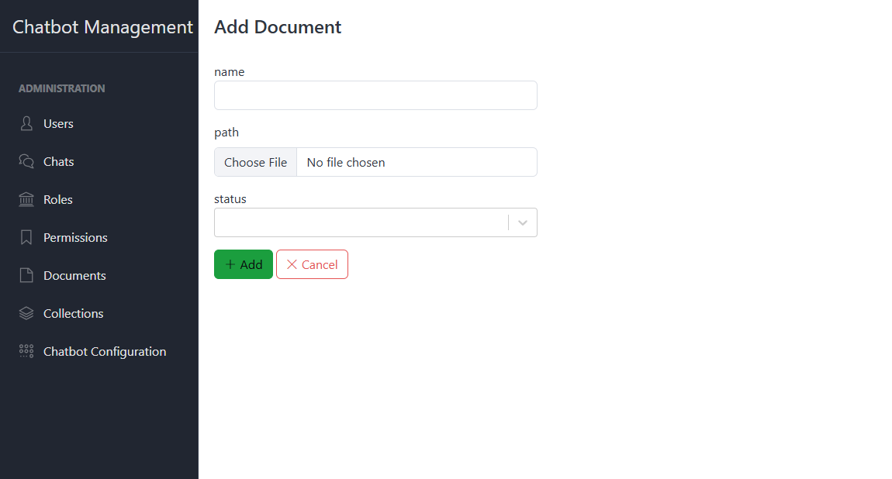
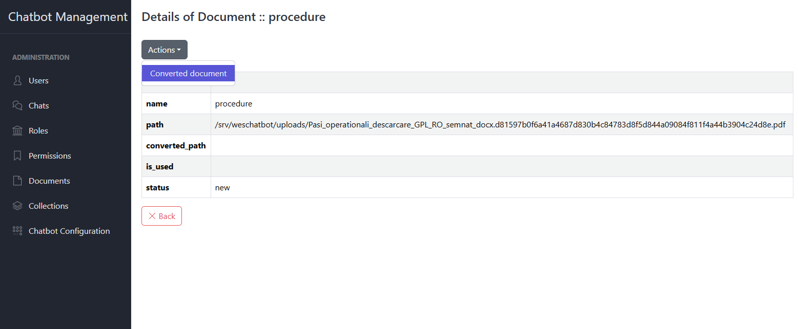
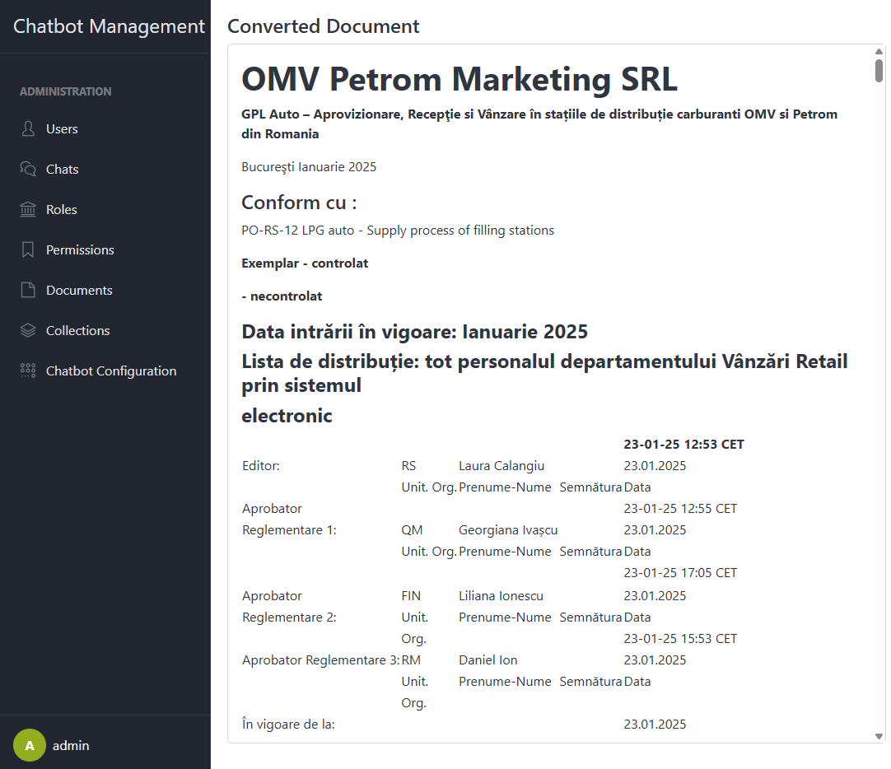
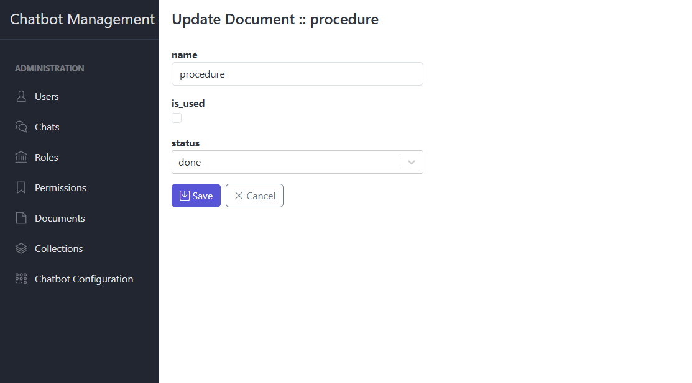

# RAG Document Management

This section describes how to ingest, browse, inspect, update, and remove documents used in Retrieval-Augmented
Generation (RAG). Only users with `document.view`, `document.upload`, `document.edit`, or `document.delete` permissions
may perform these actions.

## 1. List Documents

- Go to **Documents**.
- You will see a table with columns:
    - **Name** (or original filename)
    - **Path** (path of document on warehouse)
    - **Type** (PDF, DOCX, TXT…)
    - **Chunks** (number of Markdown pieces)
- Actions available per row:
    - **Details** – view full metadata, content, and embeddings
    - **Edit** – rename or re-upload the file
    - **Delete** – remove the document and its embeddings

## 2. Upload New Document

- Navigate to **Documents** in the sidebar then click **New**.
- In the upload form:
    - Click **Choose File** and select a PDF, DOCX, TXT, or other supported file.
    - (Optional) Enter a friendly **Title** or **Description**.
    - Click **Upload**.
- The system will:
    1. Convert the file’s contents into Markdown.
    2. Split the Markdown into smaller “chunks” for embedding.
    3. Store the chunks, their Markdown.

## 3. View Document Details

- Click **Details** on the target document.
- The detail page shows:
    - **Metadata**: Title, Filename, File Type, Size, Uploaded At
    - **Markdown Preview**: the full converted content rendered as Markdown
    - **Chunk List**: each chunk’s text excerpt and its embedding vector (for debugging)
- You can copy chunks or download the Markdown file from this view.

## 4. Edit Document

- In the **List** view, click **Edit** next to a document.
- On the edit form:
    - Change the **Title** or **Description**.
    - (Optional) Select a new file to re-upload.
- After saving, the system will:
    - If the file changed: reconvert, re-chunk, re-embed, and re-index.
    - If only metadata changed: update the title/description without touching embeddings.

## 5. Delete Document

- In the **List** view, click **Delete** next to the document.
- Confirm the deletion prompt:
  > Are you sure you want to permanently delete this document and all its embedded chunks?
- On confirmation, the document record, its Markdown chunks, and all embeddings are removed from the RAG store.
- A notification confirms successful removal.

---
