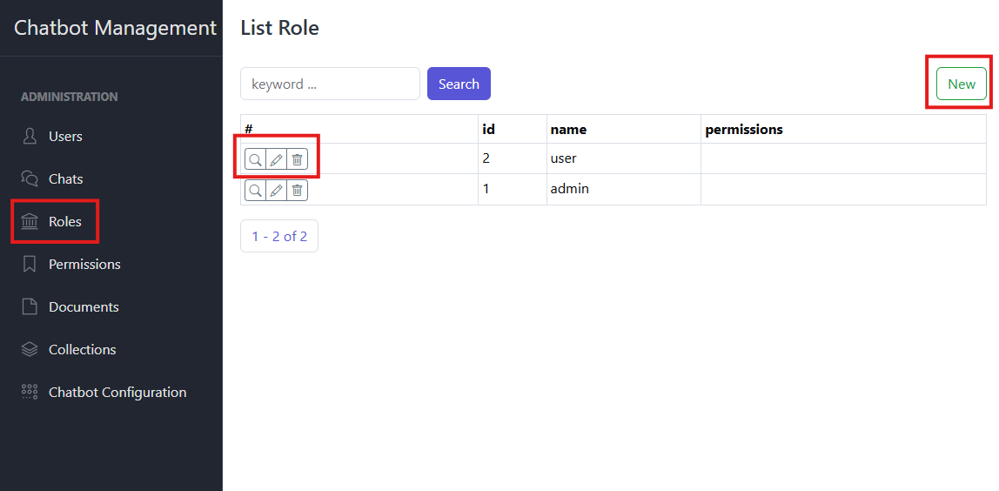
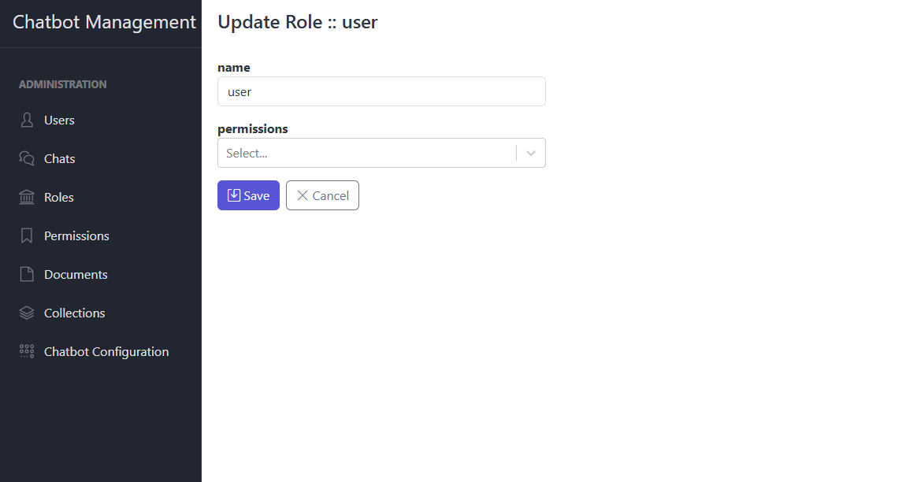
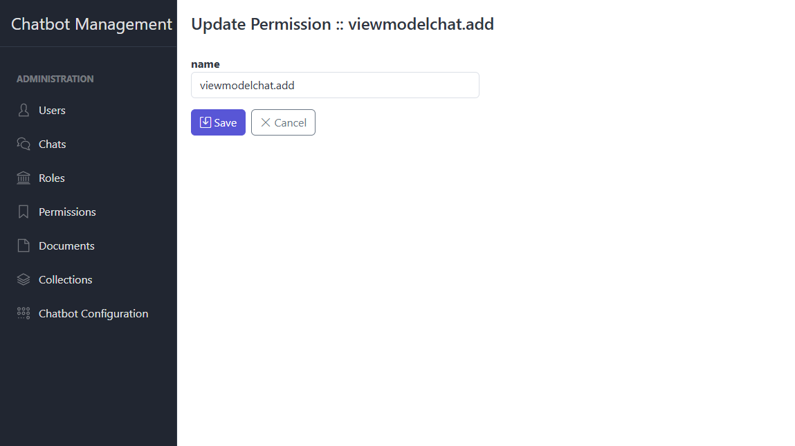

# Role-Based Access Control (RBAC)

This section explains how to manage Roles and Permissions. Only users with the appropriate admin-level permissions can
perform these actions.

---

## Roles

### 1. List Roles

- Navigate to **Roles**
- The table shows: actions, id, name, list of all permissions currently assigned

### 2. View Role Details

- Click **View** next to a role
- Displays:
    - id
    - name
    - List of all permissions currently assigned

### 3. Edit Role

- Click **Edit** next to a role
- Form fields:
    - **Role Name**
    - **Permissions** (multi-select)
- Add or remove permissions by toggling them in the list
- Click **Save** to apply changes

### 4. Delete Role

- Click **Delete** next to a role
- Confirm the deletion in the dialog
- Removal revokes the role from all users who held it

---

## Permissions

### 1. List Permissions

- Navigate to **Permissions**
- The table shows: Permission Name, id, roles

### 2. View Permission Details

- Click **View** next to a permission
- Displays:
    - Permission Name
    - id (internal identifier)
    - roles

### 3. Edit Permission

- Click **Edit** next to a permission
- Form fields:
    - **Permission Name**
- Click **Save** to update metadata

### 4. Delete Permission

- Click **Delete** next to a permission
- Confirm the deletion in the dialog
- Removal disassociates it from any roles that used it

---

> When editing a **Role**, you can assign or revoke any of the listed **Permissions** to control exactly which actions
> users in that role are allowed to perform.  
