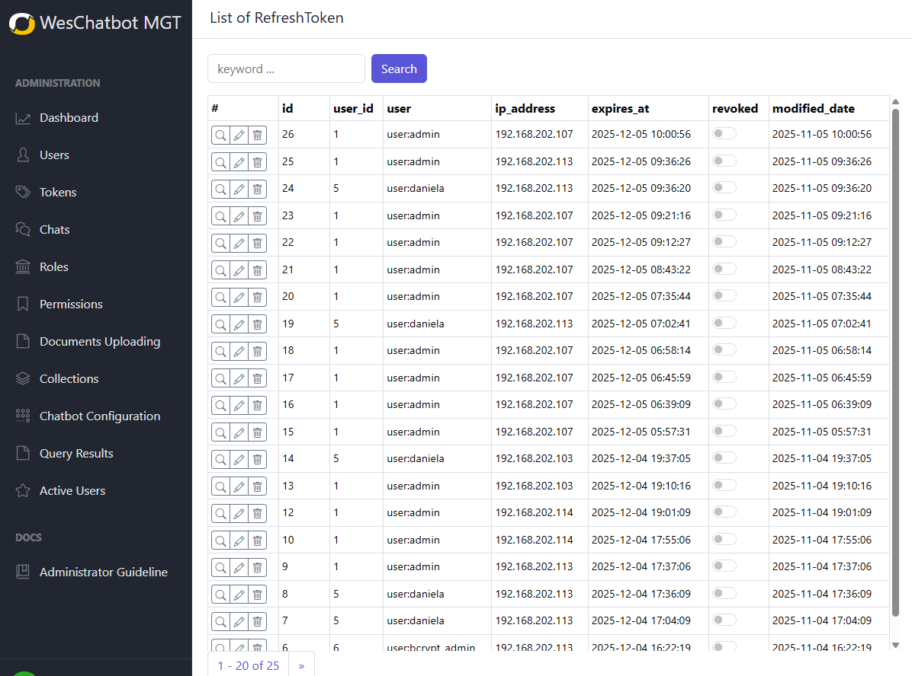

# Refresh tokens

The Tokens UI lets administrators view and manage authentication tokens (especially refresh tokens) used by clients to
obtain access. Its purpose is to monitor active tokens and immediately revoke any token to block access from compromised
or unwanted clients.

---

## Key Features

- **List Tokens**: view all refresh tokens with key metadata (token id, user, client, issued at, last used, expiry,
  status).
- **Token Details**: open a single token to see full metadata, associated user session, IP/device info, and audit
  history.
- **Revoke / Delete Token**: immediately invalidate a refresh token so it can no longer be used to obtain new access
  tokens.
- **Update Token Metadata**: (if supported) modify token attributes such as expiry or tag tokens with notes/reason for
  audit.
- **Search & Filter**: find tokens by user, client id, status (active/revoked/expired), or date ranges.
- **Bulk Actions**: select multiple tokens to revoke or export for reporting.
- **Audit Trail**: show who revoked/updated a token and when.

---

## How to use (User flow)

1. Open Tokens page from Admin menu.
2. Browse the token list:
    - Columns typically include **Token ID**, **User**, **Client**, **Issued At**, **Last Used**, **Expires At**, *
      *Status**.
    - Sort by any column to find recently used or soon-to-expire tokens.
3. Search or filter:
    - Use the search bar to find tokens by user email, client id, or token id.
    - Apply filters to show only Active, Revoked, or Expired tokens or narrow by date.
4. View token details:
    - Click a token row or the "Details" action to open the detail view (drawer or page).
    - Review associated session info, IP/device, scope, and audit history.
5. Revoke/delete a token:
    - In the token detail view or list action menu, click **Revoke** or **Delete**.
    - Confirm the action in the confirmation dialog (include reason field if available).
    - After revocation, the token status changes to **Revoked** and it should no longer allow access.
6. Update token metadata:
    - If updating is supported, click **Edit** and change expiry or add an admin note.
    - Save changes and verify audit entry is recorded.
7. Bulk revoke:
    - Select multiple tokens using checkboxes, then choose **Revoke Selected**.
    - Confirm bulk action and optionally add a reason to the audit log.

---

## Confirmation and Safety

- Revocation is irreversible for that token instance; ensure you select the correct token(s).
- UI should require explicit confirmation for delete/revoke and optionally request an admin reason for audit.
- Consider a "soft revoke" state if you need to temporarily disable a token before permanent deletion.

---

## Notifications and Effects

- After revocation, the affected client cannot exchange the refresh token for a new access token; existing access tokens
  may remain valid until expiry (depends on system policy).
- The UI should display immediate feedback (success/failure) and update the token's status in the list.
- Optionally send email or in-app notification to the associated user when their token is revoked.

---

## Troubleshooting

- Token still works after revocation:
    - Confirm the revocation API call succeeded (HTTP 200).
    - Check caching layers or distributed session stores for propagation delay.
    - Verify whether access tokens issued earlier remain valid until their expiry.
- Cannot find a token:
    - Expand search filters (date range, user variations).
    - Check whether token was already deleted or archived.
- Bulk action fails:
    - Retry with smaller batches; check for API rate limits or permission issues.
- Permission errors:
    - Ensure your admin role has token management rights.
