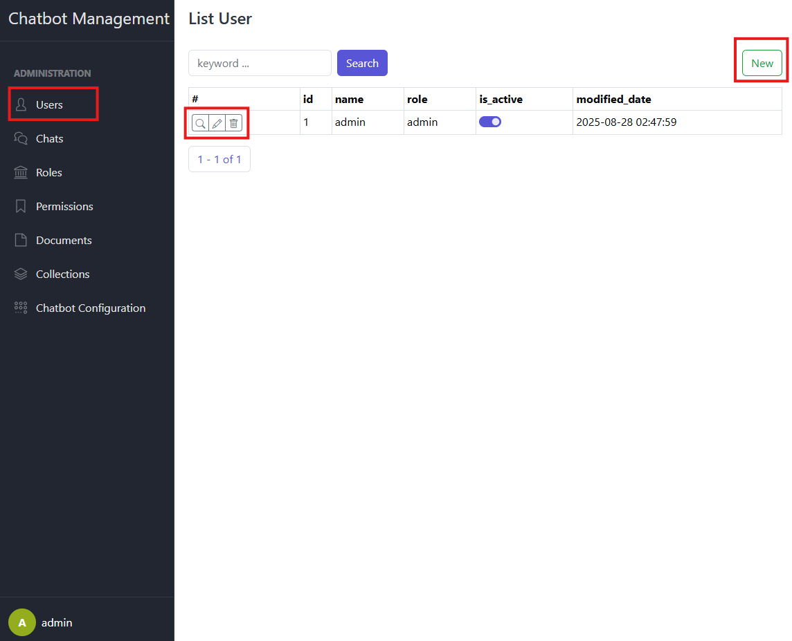
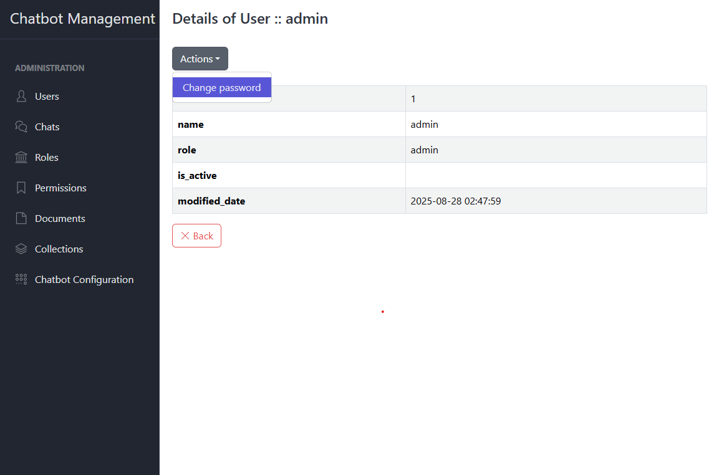
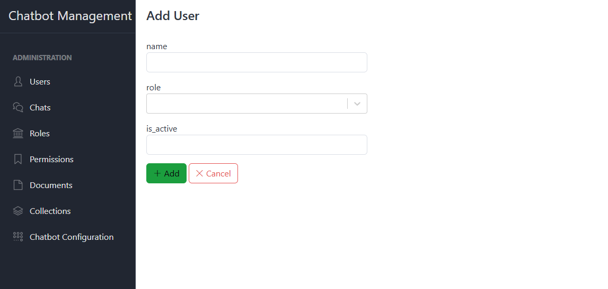
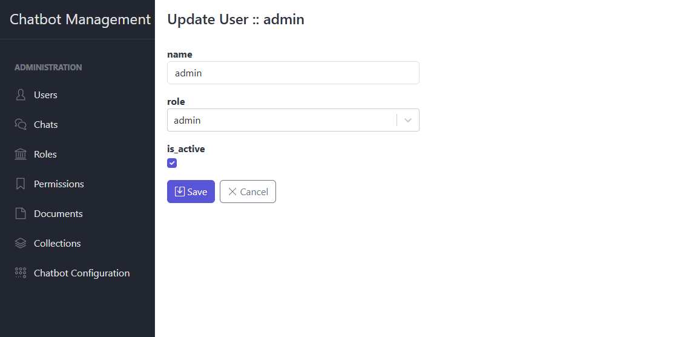

# User Management

This section covers all user-related administration tasks: listing users, viewing details, creating accounts, deleting,
password changes, and activating/deactivating users. Only authorized roles can perform these actions.

## 1. List Users

- Navigate to **Users** in the sidebar.
- The user table displays the following columns:
    - **id**
    - **name**
    - **role**
    - **is_active**
    - **modified_date**
- Use `New` button to add a new user.
- Table actions for each row:
    - **Details**
    - **Update**
    - **Delete**

## 2. View User Details

### 2.1. User Details

- Click the **Details** button in the corresponding row.
- The detail view includes:
    - **id**
    - **name**
    - **role**
    - **is_active**
    - **modified_date**

### 2.2. Change Password

- Access **User → Details** for the specific user.
- Locate the **Actions → Change Password** section.
- Enter a new password in the **New Password** field.
- Click **Update** to save the change.
- A success or error flash message appears based on the outcome.

## 3. Create a New User

- Go to **User → New**.
- Fill out the form fields:
    - **name** (required)
    - **role** (select from dropdown)
    - **is_active** (required)
- Click **Save** to create the account.
- On success, you will see a confirmation flash message.

## 4. Delete a User

- In the user list, click **Delete** on the target user’s row.
- Confirm the deletion in the dialog.
- The user account and associated sessions will be permanently removed.

## 5. Update a User

- In the user list, click **Update** on the target user’s row.
- Fill out the form fields:
    - **name** (required)
    - **role** (select from dropdown)
    - **is_active** (required)
- A flash notification confirms the status change.
